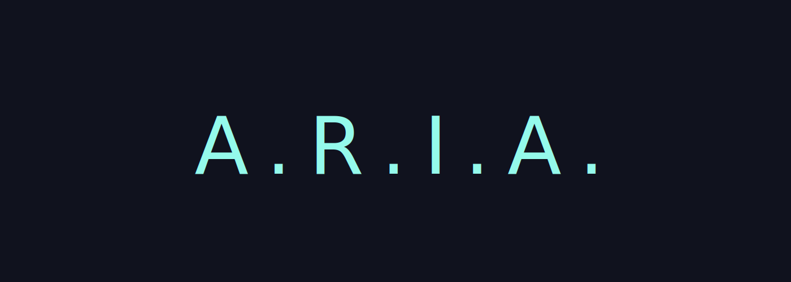
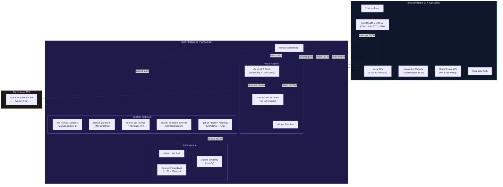
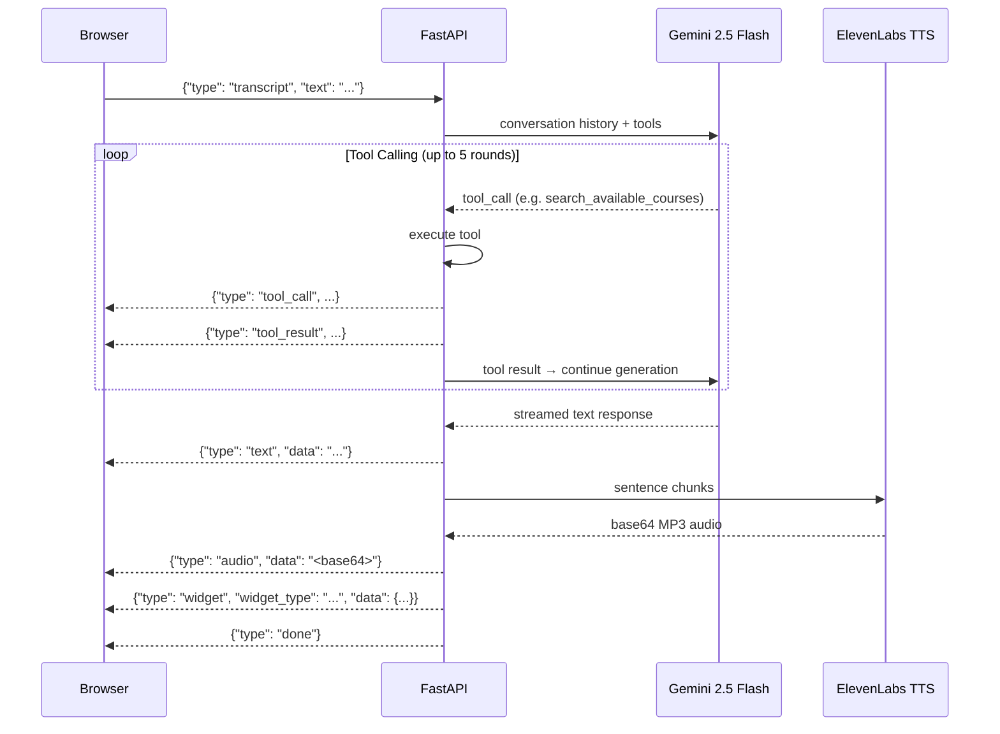

<p align="center">
  
</p>

# A.R.I.A. — Academic Resource Intelligence Assistant

A voice-first AI advisor that lets university students talk naturally to get live grades, professor ratings, degree plans, and job listings — all rendered as interactive widgets on a JARVIS-inspired HUD. One conversation replaces a dozen tabs.

## What A.R.I.A. Does

You speak naturally — *"How are my grades looking?"* or *"Find me a data science internship"* — and A.R.I.A. responds out loud while materializing interactive widgets on a glassmorphic HUD:

| Widget | Data Source | What it Shows |
|--------|------------|---------------|
| **Academic Overview** | Canvas LMS API | GPA trend, current courses with grades, flagged late assignments |
| **Degree Roadmap** | JSON DAG + RAG | Interactive prerequisite graph with clickable wildcard elective slots, PDF export |
| **Course Details** | Semantic search (1,138 courses) | Course card found via natural language query |
| **Professor Ratings** | Rate My Professors GraphQL | Quality, difficulty, would-take-again %, top tags |
| **Job Listings** | TheirStack API | Internships/jobs with salary, tech stack, apply links |

## How It Works

**Custom agentic pipeline** — no off-the-shelf chatbot framework. The full orchestration layer is built from scratch:

1. **Voice In** — ElevenLabs Scribe v2 runs client-side with VAD auto-commit. Transcripts sent to backend over WebSocket with exponential backoff reconnection.
2. **Reasoning** — Gemini 2.5 Flash with manual tool calling (AFC disabled). Multi-round execution loop supports chained tool calls. Output capped at 250 tokens for concise advisor-style responses.
3. **Tools** — Five custom scrapers/pipelines invoked autonomously by Gemini through function-calling declarations.
4. **Voice Out** — Text split at sentence boundaries, streamed to ElevenLabs TTS with adaptive chunk scheduling (`[80, 120, 200, 260]`) for ~75ms time-to-first-byte. Audio forwarded as base64 over the main WebSocket.
5. **Widgets** — After tool execution, a resolution step picks the most relevant result. Formatted into a typed payload and rendered on the frontend canvas.

### Course Catalog RAG

Instead of SQL filters, the course catalog uses **vector embeddings for semantic search**. All 1,138 courses are embedded with `all-MiniLM-L6-v2` (384-dim) offline. At query time, the student's natural language question is encoded and matched via cosine similarity using `np.argpartition` for efficient top-k retrieval. This lets Gemini search by topic, skill, or description across departments — not just by course code or major.

### Frontend Design

- **Glassmorphic HUD** — dark canvas with JARVIS-inspired grid, backdrop blur, and vignette
- **Draggable widgets** — auto-placed on a 3x2 grid zone system with jitter; z-index on focus
- **Voice Orb** — SVG arc-reactor with 4 concentric rotating rings, state-driven animations (idle/listening/processing)
- **Streaming audio** — MediaSource Extensions API for seamless MP3 chunk concatenation
- **Degree roadmap** — topological layering algorithm, color-coded nodes, wildcard elective dropdowns, PDF export
- **Auth** — Supabase Auth with React context provider

## Prerequisites

- **Python 3.12+** and [uv](https://docs.astral.sh/uv/) (backend package manager)
- **Node.js 18+** and npm (frontend)
- API keys listed below

## Environment Variables

All secrets live in a single `.env` file **at the repository root** (not inside `backend/`). Vite is configured with `envDir: '..'` so both the frontend and backend read from the same file.

Copy `backend/.env.example` and fill in your values:

| Variable | Purpose |
|----------|---------|
| `GEMINI_API_KEY` | Google Gemini 2.5 Flash |
| `ELEVENLABS_API_KEY` | ElevenLabs TTS + Scribe STT token |
| `canvas_API` | Canvas LMS personal access token |
| `theirstacks_API` | TheirStack job listings API key |
| `VITE_SUPABASE_URL` | Supabase project URL (frontend auth) |
| `VITE_SUPABASE_ANON_KEY` | Supabase anonymous key (frontend auth) |

## Running

**Backend:**

```bash
cd backend
uv sync
uv run uvicorn main:app --reload --port 8000
```

**Frontend:**

```bash
cd front-end
npm install
npm run dev
```

The Vite dev server runs on `http://localhost:5173` and proxies `/ws` and `/scribe-token` to the backend at `localhost:8000`.

**Rebuild course embeddings** (only needed if `availablecourses.db` changes):

```bash
cd backend
uv run python tools/build_embeddings.py
```

## Built With

| Technology | Purpose |
|---|---|
| **React 19** | Frontend UI — no external component libraries |
| **TypeScript** | Type-safe frontend development |
| **Vite 5** | Dev server with WebSocket/API proxy |
| **FastAPI** | Python backend HTTP + WebSocket server |
| **Google Gemini 2.5 Flash** | LLM for reasoning and autonomous tool calling |
| **ElevenLabs Scribe v2** | Real-time client-side STT with VAD |
| **ElevenLabs Flash v2.5** | Streaming TTS via WebSocket (voice: Alice) |
| **Supabase** | User authentication and session management |
| **sentence-transformers** | Embedding model (`all-MiniLM-L6-v2`, 384-dim) |
| **NumPy** | Cosine similarity vector search |
| **Canvas LMS API** | Live student grades and assignments |
| **Rate My Professors GraphQL** | Professor ratings and reviews |
| **TheirStack API** | Job/internship listing search |
| **SQLite** | Course catalog database (1,138 courses) |
| **MediaSource Extensions** | Seamless client-side MP3 streaming |
| **html2canvas + jsPDF** | Degree roadmap PDF export |

## Architecture Diagrams

<details>
<summary>System Architecture (click to expand)</summary>



</details>

<details>
<summary>WebSocket Message Protocol (click to expand)</summary>

All communication is multiplexed over a single persistent WebSocket:



</details>
